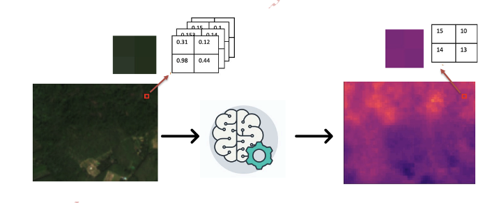
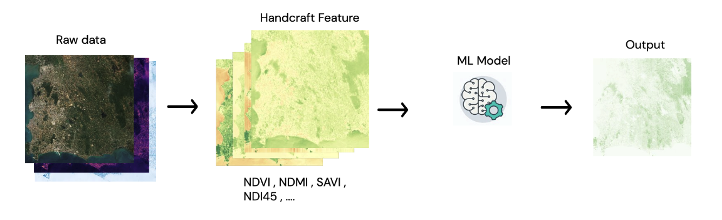
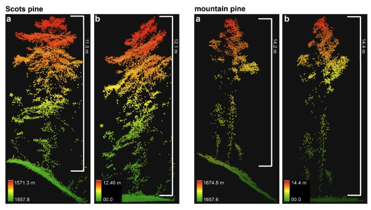
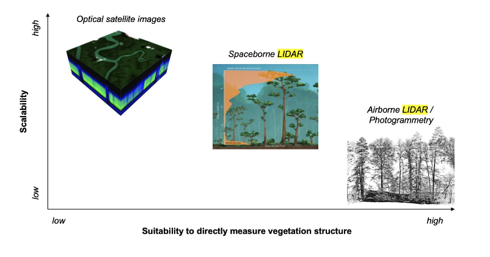
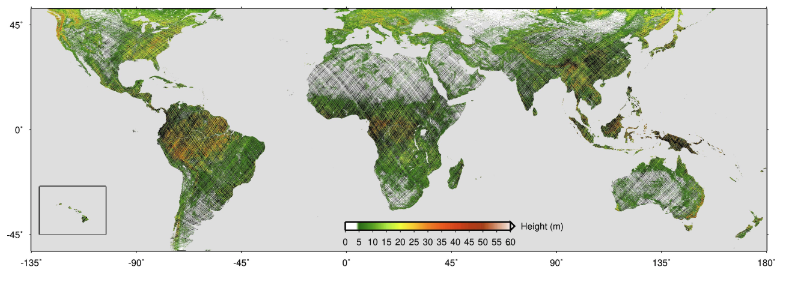
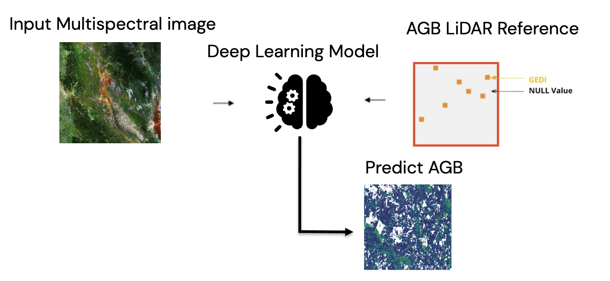
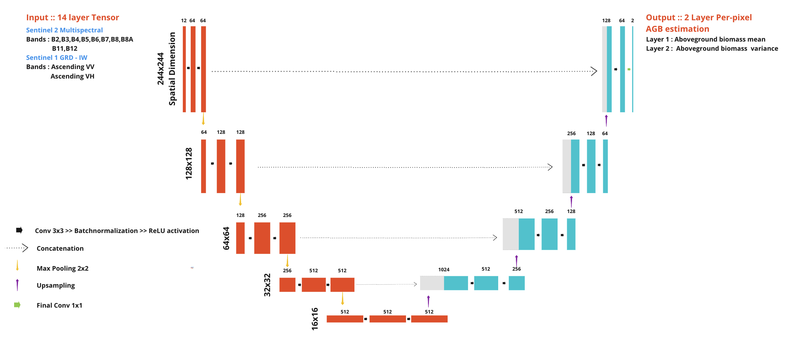
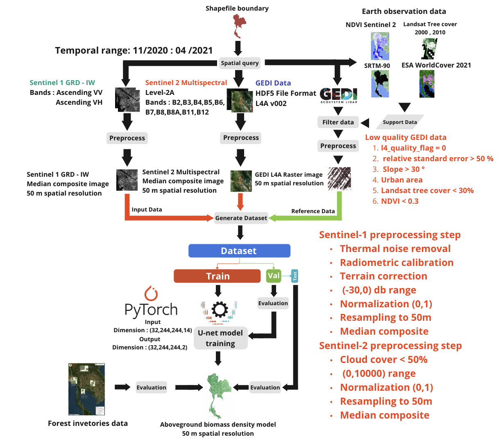

+++
title = 'Deep Learning Approach'
date = 2024-02-07T13:32:10+07:00
weight = 3
+++


The goal of this study  is to estimate the value of aboveground biomass (ABG) using satellite remote sensing data. By develop models that imitate the allometric equations ofvarious reported studies targeting forest types in Thailand,covering all forms of allometric equations within a single model. With artificial intelligence technology. The problem can be identified by creating a regression model. That is, satellite image data is used as a predictor variable in a model. A model will inference ABG value at each pixel point, which is technically called pixel-wise regression.



> Figure : concept of pixel-wise regression


In the development, Deep learning approach was choose to develop the model. Due to the development process of the model using  traditional machine learning methods, data need to extract useful information  first, which is doing through the process of feature extraction from satellite image data. Currenty many researchs have ambiguous conclusion on which of Vegetation Index calcalate from Multispectral Sentinel-2 and SAR Sentinel-1 satellite images are related to ABG. So the correlation between forest features and the spectral characteristics of wave data obtained from remote sensing data is complex and
not yet proven on their interrelation .



> Figure : concept of concept of machine learning approach 

On the other hand, Deep Learning approach can import raw data into the model as predictor variables. Feature extraction is done itself by the algorithm. This is useful when tackle complex problem where the relation between input and output and input by itself is unclear. The conditions require is a large amount of training set data and use more time and computational resources. Since the satellite data used was large enough, Deep Learning methods were used for experimentation and testing.

Satellite missions such as Sentinel-2 or Landsat, which have been designed for a broader range of Earth observation needs, deliver freely accessible archives of **optical images that are not as tailored to vegetation structure,** but offer longer-term global coverage at high spatial and temporal resolution. ​


**However, estimating forest characteristics like canopy height or biomass from optical images is a challenging task, as the physical relationships be- tween spectral signatures and vertical forest structure are complex and not well under- stood**

On the other hand ,LiDAR data provide direct measure vegetation structure such as height , volume ​



While airborne laser scanning (ALS) or photogrammetry campaigns provide high-resolution 3D-data from which canopy height can be derived with low error, their coverage is limited to regional scales. In contrast, spaceborne LI- DAR (like GEDI, a LIDAR sensor mounted on the International Space Station since December 2018) offers the advantage of global coverage, but with lower spatial resolution and more difficult interpretation compared to ALS data due to atmospheric noise and geolocation uncertainty 

**Spaceborne LiDAR are in good position between scalability and suitability to direcly measure vegetation structure.**



NASA’s GEDI campaign, which has been collecting full-waveform LIDAR data explicitly for the purpose of measuring vertical forest structure globally, between 51.6◦ north and south. It's geographical range, and also its spatial and temporal resolutions, are limited. The mission length, initially set to two years, does not allow for continuous forest monitoring into the future. Moreover, GEDI is a sampling mission expected to cover at most 4% of the land surface. ​ ​

**Due to the sensor properties, GEDI data has sparse spatial and temporal resolutions. Not cover all area of the globe**



**Using only data from multispectral imagery or radar imagery may not be sufficient for model development.** But missions such as Sentinel-2 and Sentinel-1 have been extensively reported for their potential in building models to estimate AGB density value. Although both datasets do not directly assess the physical structure of forests, these two satellites have a high spatial-resolution and extensive coverage of the earth's surface with higher measurement frequency. Therefore, **Sensor fusion between GEDI and multi-spectral optical imagery has the potential to overcome the limitations of each individual data source.**



>Figure : Sparse-supervision model concept of the project.

## Model architecture

U-Net, which a Convolutional Neural Network, works well and commonly used in image-related work that requires extracting complex image features. In this study,Because of GEDI sensor properties. The reference data are not cover every pixel within the image. This places a limit on the amount of data available for training deep learning models. But, the U-Net architecture has been reported about the capability to develop the model using less training data than other models in that time. Moreover, the U-Net model can learn coordinate features. (localization), which is useful in this study because it requires accuracy in predicting aboveground biomass in each pixel.

The model structure consists of the path used to reduce the spatial data (downsample) and the path used to expand the spatial data size (upsample), together  two parts a shape of "U".

The downsample path starts with convolution from a 3x3 kernel and maintains the spatial resoulution then follow by rectified linear unit (ReLU) activation function.

Reduce the size by max pooling with a 2x2 kernel (stride = two pixels ), repeated the process four times. Each time, twice the number of features are extracted.

The upsample path, each level take data from the same level in downsample path to add spatial information lost from reducing the size of the image.

The image starts with convolution from a 3x3 kernel and maintains the spatial resoulution then follow by rectified linear unit (ReLU) activation function.

Bilinear upsampling was use to increase the spatial resolution in each level.  repeated the process four times same as downsample path. 

The feature of the data are then decode into spatial information and reduce by 1/4 each level

In the final level, aboveground biomass data was decode from a 1x1 convolution kernel and scales back to the same spatial resoultion as the input.

The model has approximately 17 million adjustable parameters.


> Figure : Modify U-Net Model architecture, note that varince in output layer will be explian in uncetainty estimnation section

By this development The U-Net model has been applied to satellite image data, consisting of data from Sentinel-2 satellites, 12 bands, and Sentinel-1, 2 bands. The model learns and extracts data characteristics through each image point stored in the images and GEDI data serve as ground truth of the sentinel-1 and sentinel-2 predictr variables.

## Implementation

Pytorch implementation of modify UNET

```
import torch
import torch.nn as nn
import torch.nn.functional as F

```

We start by creating sub-component of UNET

First, create component in upsample path. For each level, there are convolution follow by BatchNormalization then appy ReLU activation function , repeat two times. We defind as  DoubleConv class.


```
class DoubleConv(nn.Module):
    """(convolution => [BN] => ReLU) * 2"""

    def __init__(self, in_channels, out_channels, mid_channels=None):
        super().__init__()
        if not mid_channels:
            mid_channels = out_channels
        self.double_conv = nn.Sequential(
            nn.Conv2d(in_channels, mid_channels, kernel_size=3, padding=1, bias=False),
            nn.BatchNorm2d(mid_channels),
            nn.ReLU(inplace=True),
            nn.Conv2d(mid_channels, out_channels, kernel_size=3, padding=1, bias=False),
            nn.BatchNorm2d(out_channels),
            nn.ReLU(inplace=True)
        )

    def forward(self, x):
        return self.double_conv(x)


```

After each level in downsample path finished DoubleConv to extract feature, we process to downsample by using maxpooling follow by DoubleConv immediately. define as Down class.

```
class Down(nn.Module):
    """Downscaling with maxpool then double conv"""

    def __init__(self, in_channels, out_channels):
        super().__init__()
        self.maxpool_conv = nn.Sequential(
            nn.MaxPool2d(2),
            DoubleConv(in_channels, out_channels)
        )

    def forward(self, x):
        return self.maxpool_conv(x)

```

For upsample path , the process of convolution -> BatchNormalization -> ReLU  are the same as dowmsampl path. we reuse DoubleConv class. also for each level of up sample path, a concatenation with the layer in the same level in downsample path is require so we need extra padding.

We define upsample component as Up Class. The process in this class is upsample the input -> padding so data can concatenate with downsample input in the same level -> 2x  convolution -> BatchNormalization -> ReLU 

```
class Up(nn.Module):
    """Upscaling then double conv"""

    def __init__(self, in_channels, out_channels, bilinear=True):
        super().__init__()

        # if bilinear, use the normal convolutions to reduce the number of channels
        if bilinear:
            self.up = nn.Upsample(scale_factor=2, mode='bilinear', align_corners=True)
            self.conv = DoubleConv(in_channels, out_channels, in_channels // 2)
        else:
            self.up = nn.ConvTranspose2d(in_channels, in_channels // 2, kernel_size=2, stride=2)
            self.conv = DoubleConv(in_channels, out_channels)

    def forward(self, x1, x2):
        # Same dimension
        x1 = self.up(x1)
        diffY = x2.size()[2] - x1.size()[2]
        diffX = x2.size()[3] - x1.size()[3]

        x1 = F.pad(x1, [diffX // 2, diffX - diffX // 2,
                        diffY // 2, diffY - diffY // 2])
        x = torch.cat([x2, x1], dim=1)
        return self.conv(x)

```

For output layer , since we need to estimate uncertainty. The output will have 2 layer

- Output prediction : using only 1x1 convolution to produce regression output

```
class OutMeanConv(nn.Module):
    def __init__(self, in_channels, out_channels):
        super(OutMeanConv, self).__init__()
        self.conv = nn.Conv2d(in_channels, out_channels, kernel_size=1)

    def forward(self, x):
        return self.conv(x)
```
- Variance : use 1x1 convolution and softpuls activation function to keep value positive

```
class OutStdConv(nn.Module):
    def __init__(self, in_channels, out_channels):
        super(OutStdConv, self).__init__()
        self.out = nn.Sequential(
            nn.Conv2d(in_channels, out_channels, kernel_size=1),
            nn.Softplus()
        )

    def forward(self, x):
        return self.out(x)
```

We define the modify U-NET as we describe earlier. First we import the component we just create.
```
from .unet_parts import *
import torch

```

Then we  assembly the parts together  to form the complete network
**don't forget that the output layer mean and variance output**

```
class UNet(nn.Module):
    def __init__(self, n_channels, bilinear=False):
        super(UNet, self).__init__()
        self.n_channels = n_channels
        self.bilinear = bilinear

        self.inc = (DoubleConv(n_channels, 64))
        self.down1 = (Down(64, 128))
        self.down2 = (Down(128, 256))
        self.down3 = (Down(256, 512))
        factor = 2 if bilinear else 1
        self.down4 = (Down(512, 1024 // factor))
        self.up1 = (Up(1024, 512 // factor, bilinear))
        self.up2 = (Up(512, 256 // factor, bilinear))
        self.up3 = (Up(256, 128 // factor, bilinear))
        self.up4 = (Up(128, 64 // factor, bilinear))
        self.meanlayer = (OutMeanConv(32 , 1)) # Mean Pixel-wise Regression
        self.stdlayer = (OutStdConv(32 , 1)) # Standard Deviation

    def forward(self, x):
        x1 = self.inc(x)
        x2 = self.down1(x1)
        x3 = self.down2(x2)
        x4 = self.down3(x3)
        x5 = self.down4(x4)
        x = self.up1(x5, x4)
        x = self.up2(x, x3)
        x = self.up3(x, x2)
        shared = self.up4(x, x1)
        mean = self.meanlayer(shared)
        std = self.stdlayer(shared)
        #return torch.distributions.Normal(mean, std)
        return mean , std

    def use_checkpointing(self):
        self.inc = torch.utils.checkpoint(self.inc)
        self.down1 = torch.utils.checkpoint(self.down1)
        self.down2 = torch.utils.checkpoint(self.down2)
        self.down3 = torch.utils.checkpoint(self.down3)
        self.down4 = torch.utils.checkpoint(self.down4)
        self.up1 = torch.utils.checkpoint(self.up1)
        self.up2 = torch.utils.checkpoint(self.up2)
        self.up3 = torch.utils.checkpoint(self.up3)
        self.up4 = torch.utils.checkpoint(self.up4)
        self.outc = torch.utils.checkpoint(self.outc)

```

## Model training procedures

U-Net model with satellite image data was develop using deep learning sparse supervision approach to learn parameters and predict ABG results.

Pytorch framework was use as a to train candidate ensemble model ,The model uses different random initialization parameters as a starting point.

The models calculated loss only at the pixels with GEDI footprint by Gaussian negative log-likelihood function.  For the model optimizer, ADAM
was used to minimize the loss function during the training.

The data was divided into 32 batches and the learning rate size was adaptively adjusted using Cyclical "Triangular2" scheduling. This technique helps the parameters get closer to the optimal point and avoids the model parameters from convergence.


> Figure: pattern of Cyclical "Triangular2"  learning rate scheduling.

The learning rate began at 0.0000001 and reached a maximum of 0.1.

The models were trained for 100 epochs, but Early Stopping technique was applied when no significant improvement was observed in the validation accuracy.



> Figure: Flow of the trainging procedures of one candidate endemble model

#### Hyperparameter table

| Hyperparameter | value	 | 
|:------:|:------:|
|Epochs| 	100|
|Optimizer| 	ADAM|
|Loss function|	Gaussian negative log-likelihood| 
|Base learning rate|	1e-7|
|Max learning rate|	0.1|
|Batch size|	32|
|Weight decay|	1e-8|
|Lr cyclic step size|	2000|
|Gradient clipping|	1.0|
