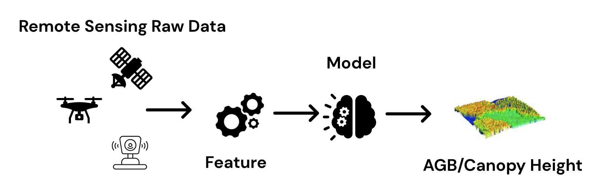
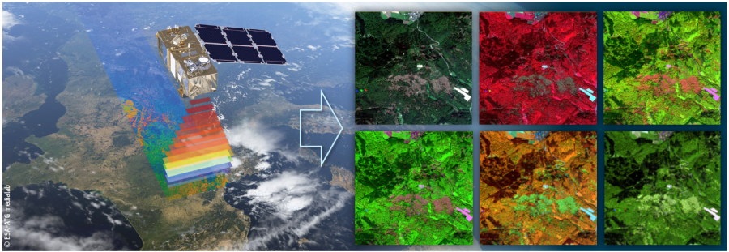

+++
title = 'Introduction'
date = 2024-02-02T21:14:07+07:00
weight = 1
+++

## Problem Assessment

##### Why we have this project?

 

- Goals of this project is to create a models that can inference forest structure-related value such as aboveground biomass density , canopy height in given area by using only remote sensing data.​​

- Traditional field inventory methods reliably estimate forest stucture data but it has cost and time constraints, also low scalability.
​
{}
**Forest inventory** is the systematic collection of data on the forestry resources within a given area. It allows assessment of the current status and lays the ground for analysis and planning, constituting the basis for sustainable forest management.
{}

Currently, the standard method for measuring carbon stock is measuring trees in random small areas of the forest, called sample plots to measure the growth of the tree's diameter and height, Then carbon stock can be calculate using allometric equations (more details in [Biomass](/Theorem/Biomass) section)

While the advantage of this method the output produce very high accuracy and resolution, it's requiring a lot of human resources, time, and expenses. Affects the cost and duration of assessments if we want to scale in large areas.

Remote sensing technology using satellite imagery, on the other hand suitable for surveying the geography and scaling for a large areas in a short period of time with high revisiting fequency.

